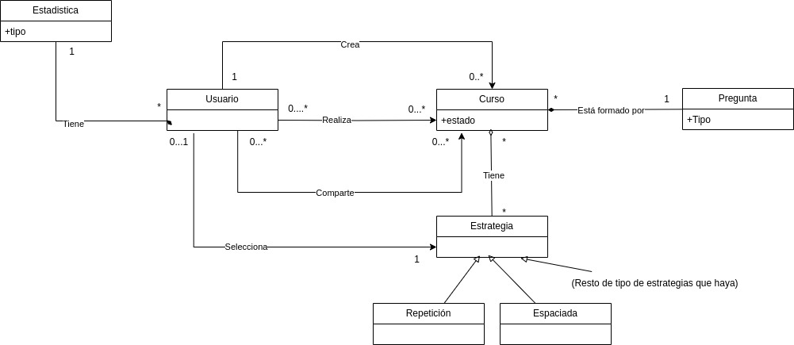

# Entrega 1 PDS

## Entregable de Prácticas 1  
**Proceso de Desarrollo Software**

### Realizado por:  
- **Youssef Bouaouiouich Souidi** (G2.1)  
- **Joaquín Manuel Redón Sánchez** (G2.1)  
- **Marcos Davidson Antón** (G2.1)  

**Profesor:**  
Jesús Sánchez Cuadrado  

**Repositorio:**  
[GitHub - Proyecto PDS](https://github.com/YoussefUMU/proyecto-pds-24-25.git)

---

## Índice  
1. [Identificación de casos de uso](#identificación-de-casos-de-uso)  
2. [Desarrollo de casos de uso](#desarrollo-de-casos-de-uso)  
   - [Caso de Uso 1: Seleccionar la estrategia de aprendizaje](#caso-de-uso-1-seleccionar-la-estrategia-de-aprendizaje)  
   - [Caso de Uso 2: Guardar las estadísticas de uso](#caso-de-uso-2-guardar-las-estadísticas-de-uso)  
3. [Modelado de dominio](#modelado-de-dominio)  

---

## Identificación de casos de uso  

### Actor y Objetivo  

| Actor   | Objetivo |
|---------|---------|
| **Usuario** | - Añadir nuevos tipos de preguntas   - Seleccionar la estrategia de aprendizaje   - Crear cursos   - Compartir cursos creados |
| **Sistema** | - Ofrecer distintos tipos de estrategias   - Guardar estado actual del curso   - Restaurar estado previo del curso   - Guardar las estadísticas de uso   - Permitir la instalación de nuevos cursos en su biblioteca interna |

---

## Desarrollo de casos de uso  

### Caso de Uso 1: Seleccionar la estrategia de aprendizaje  

**Resumen:**  
Cuando un usuario va a realizar un curso, tiene que poder elegir la estrategia de aprendizaje. Algunas opciones pueden ser:  
- **Secuencial:** Una pregunta tras otra en un orden predefinido.  
- **Repetición espaciada:** Repetir la misma pregunta cada ciertas preguntas (ejemplo: cada 3 preguntas).  
- **Aleatoria:** Orden de preguntas al azar.  

**Actor Principal:** Usuario  

**Flujo Básico:**  
1. El usuario selecciona un curso y quiere elegir el tipo de estrategia.  
2. El sistema muestra los distintos tipos de estrategia.  
3. El usuario elige una opción.  
4. El sistema muestra las preguntas del curso de acuerdo con la estrategia seleccionada.  

**Extensiones (Flujos Alternativos):**  
- **3a.** El usuario se equivoca y no escoge la estrategia que quería.  
  - Sale al menú principal.  
  - Selecciona nuevamente el curso.  
  - En lugar de seleccionar "continuar", elige "volver a empezar".  
  - El usuario selecciona la estrategia correcta.  
- **1b.** El sistema no tiene cursos disponibles.  
  - Se notifica al usuario que no hay cursos para seleccionar.  

---

### Caso de Uso 2: Guardar las estadísticas de uso  

**Resumen:**  
La aplicación debe guardar estadísticas de uso como:  
- Contar el tiempo de uso.  
- Calcular la mejor racha (ejemplo: número de días consecutivos).  

**Actor Principal:** Sistema  

**Flujo Básico:**  
1. El sistema lleva un registro de las estadísticas de uso relevantes.  
2. El sistema detecta cuando un usuario cierra un curso.  
3. El sistema persiste las estadísticas en la base de datos (BBDD).  

**Extensiones (Flujos Alternativos):**  
- **2a.** El usuario nunca cierra un curso.  
  - El sistema dispone de un **timeout** para cada pregunta.  
  - Si se excede el tiempo, el sistema asume que el usuario no está conectado.  
  - El sistema persiste las estadísticas en la BBDD y cierra automáticamente el curso.  

---

## Modelado de dominio  

El modelo de dominio representa la relación entre **usuarios**, **cursos**, **preguntas** y **estrategias de aprendizaje**.  

- Un **usuario** puede **crear, realizar y compartir cursos**.  
- Los **cursos** contienen diferentes **preguntas** organizadas por tipo.  
- Los **usuarios pueden seleccionar estrategias de aprendizaje** (como repetición o repaso espaciado) para mejorar la memorización.  
- Cada curso **mantiene un estado**, permitiendo **reanudar el progreso en cualquier momento**.  
- La aplicación **registra estadísticas** sobre el uso (como tiempo de estudio o rachas de actividad), ofreciendo un sistema flexible y escalable para el aprendizaje interactivo.  

---
